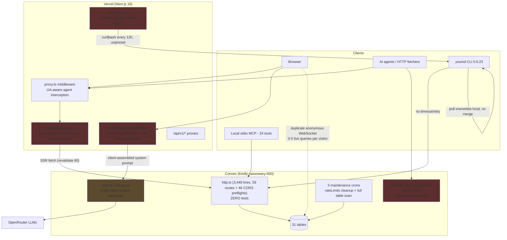
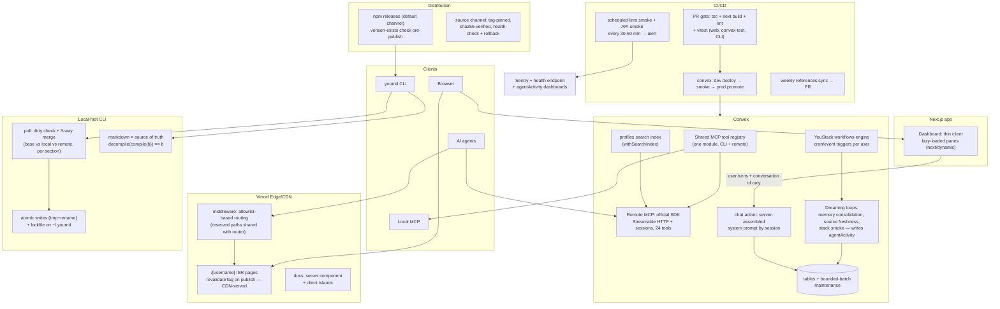

# Architecture Evolution — 2026-06-11

Current vs target architecture for scaling you.md to millions of users/agents while staying delightful for solo builders.

## Current Architecture

Red nodes: scale or security hazards. Amber: trust-boundary defect.

### Current pain points (deduped across all four audits)

| # | Pain | Root cause |
|---|---|---|
| 1 | Per-view lambda + WebSocket cost on profiles | force-dynamic + ungated anonymous Convex subscriptions |
| 2 | Prompt IP + injection surface in browser | client-assembled system prompt, pass-through proxy |
| 3 | Identity data mutates/loses on sync | lossy regex round-trip; pull has no dirty check; base.json never used as a merge base (only read by push's size/diff guard and the compiler skeleton fallback) |
| 4 | Fleet-wide brick risk | unpinned source install + 12h curl-bash auto-upgrade |
| 5 | Untested prod deploys | zero convex/src tests; push-to-main = prod deploy, no gate |
| 6 | MCP claim/reality gap | two unshared tool registries (24 local vs 5 remote) |
| 7 | Blind in production | no error tracking, no scheduled smoke, raw errors to clients |
| 8 | Self-improvement dormant | audit loop + reference sync exist but unscheduled |

## Target Architecture

## Migration Notes

Ordered to avoid rework; each phase is independently shippable.

### Phase 1 — Stop the bleeding (this week)
1. **ISR profiles**: remove `force-dynamic` from `src/app/(app)/[username]/page.tsx`; gate `useQuery` calls in `profile-content.tsx` with `"skip"` until `useConvexAuth` confirms a session; render anonymous visitors purely from `ssrData`. No schema change.
2. **CI gate**: one workflow running `tsc --noEmit` + `next build` + `npm run lint` on every PR. Add a test+smoke job as dependency of `convex-deploy.yml`; flip prod deploy to dev-first promotion.
3. **Install channel**: default `INSTALL_CHANNEL` to `npm` in `src/app/install.sh/route.ts`; pin source channel to a release tag; add `youmd --version` health check + rollback to the auto-upgrade helper.
4. Fonts, viewport, RESERVED_PATHS additions — trivial one-file fixes bundled into Phase 1 PRs.

### Phase 2 — Trust boundaries and sync safety (1-2 weeks)
1. **Server-side prompt assembly**: new Convex action accepts `{conversationId, userTurns}`; assembles SYSTEM_PROMPT + identity context server-side; `convex/chat.ts` rejects client system messages. Client keeps parsing/rendering logic only. Migrate dashboard + CLI chat callers in the same PR set.
2. **Pull-side merge**: dirty check before `decompileToFilesystem` (compare local bundle hash vs `lastPushedHash`); refuse or prompt unless `--force`; then per-section 3-way merge using the already-saved `base.json`. Fix `lastPulledHash` to record the hash of the bundle actually written (not the draft's).
3. **Atomic writes**: one persistence helper (tmp + `renameSync` + lockfile) replacing the 92 raw `writeFileSync` calls; `mode: 0o600` on config.json; preserve corrupt files as `.bak`.

### Phase 3 — MCP unification (2-3 weeks)
1. Extract tool definitions from `cli/src/mcp/server.ts` into a shared registry module (name, schema, handler interface). Local server consumes directly; remote handler maps registry handlers onto Convex `runQuery`/`runMutation`.
2. Replace the hand-rolled JSON-RPC switch in `convex/http.ts:2748-3077` with the official MCP SDK Streamable HTTP transport (Node runtime route or spec-compliant Convex implementation with `Mcp-Session-Id` + SSE).
3. Add `withSearchIndex` on profiles for `search_profiles`; sanitize all MCP error responses to stable codes.
4. Contract test suite over the registry (table-driven, ~24 cases) shared by both servers.

### Phase 4 — Lossless identity + delta sync (3-4 weeks)
1. Extend raw-markdown-field pattern to about/bio, projects, custom sections; parsed fields become server-derived metadata. Property test on `cli/examples/` fixtures.
2. Replace 32-bit `simpleHash` manifest entries with per-section sha256 (reuse `sha256File` from youstack.ts) — enables delta push/pull and section-level conflict diagnosis.
3. Extract `canonicalJsonString` into a shared package consumed by CLI and convex/ to kill cross-implementation hash drift.

### Phase 5 — Self-improving infrastructure (ongoing)
1. Schedule the audit loop (GitHub Actions cron or Claude Code routine) with an atomic `mkdir` lock replacing the `touch` lock; weekly `references:sync` cron opening a PR.
2. Add `workflows` to the YouStack manifest schema (`trigger: cron|event|manual`, steps referencing capabilities); Convex scheduler executes per user.
3. First dreaming loop: nightly memory consolidation via the existing Haiku summarizer in `convex/chat.ts`, writing results into `memories` + `agentActivity` — identity visibly improves while the user sleeps.
4. Observability substrate: Sentry on Next.js + Convex, `/api/v1/health` exposing spend-cap/rate-limit counters, agentActivity-backed agent-traffic dashboards.
