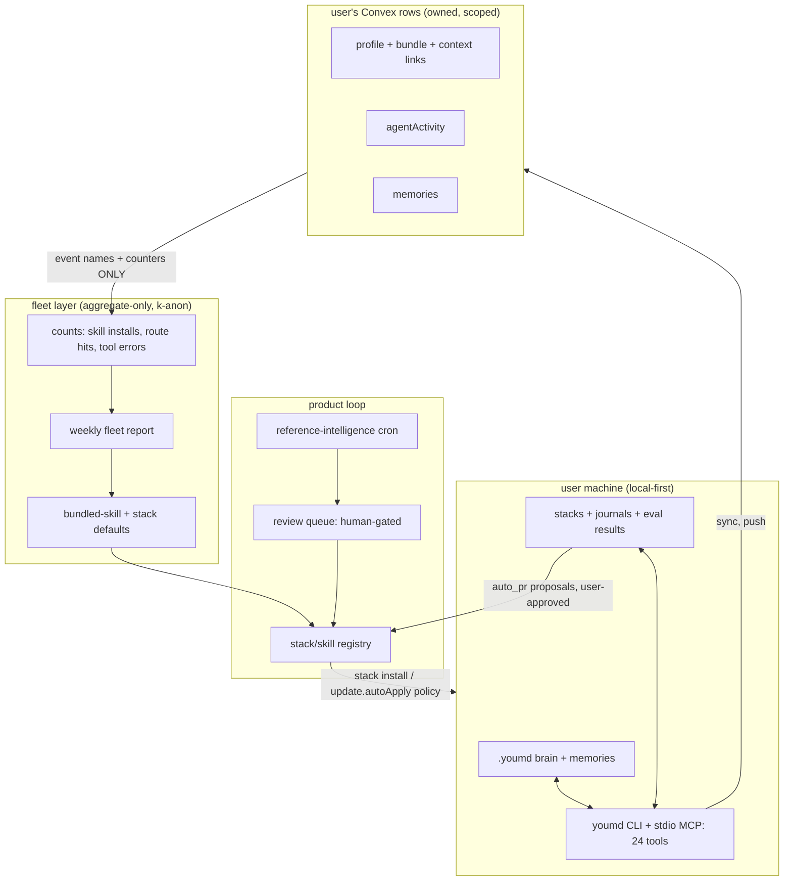

# Global Evolution Roadmap — You.md as a Living Network — 2026-06-11

How You.md graduates from "a product Houston improves" to "a network that improves itself" — while staying local-first and privacy-first. Builds on SELF-IMPROVING-SYSTEM-DESIGN.md (same date); this document covers the product-level and fleet-level loops and their staged rollout.

**The privacy contract, stated once and enforced everywhere:** only event names and counters ever cross a user boundary — never memory content, identity field values, prompts, or stack journals. Aggregation happens behind a k-anonymity threshold. Everything else stays on the user's machine or in their own Convex rows.

---

## 1. Where the global loop stands today

| Loop | Reality | Evidence |
|---|---|---|
| Upstream learning (reference-intelligence) | Works but manual and noisy: keyword-regex classification produced 12 near-identical "YouStacks skill ergonomics" tasks from doc-churn in one repo; runs only via hand-run `npm run references:sync`; no cron schedules it | `scripts/reference-intelligence.mjs:137-206`, `project-context/reference-intelligence/TASKS.md:16-51`, `package.json:27`, `convex/crons.ts:28-52` |
| Fleet learning | Does not exist beyond a downloads counter and per-user useCount that nothing aggregates | `convex/skills.ts:634-643,652-684` |
| Docs/trust surface | Generated + drift-checked (excellent), but advertises 24 MCP tools where the hosted endpoint ships 5, and the published JSON-RPC example fails live (calls `get_identity` without the required `username`) | `src/generated/docs-reference.ts:27-29`, `convex/http.ts:2788-2856,2861-2864`, `public/llms-full.txt:133-145` |
| Stack ecosystem | Routing, doctor, smoke, adapters with embedded self-improvement protocol all exist; no install verb, no improvement runner, no signal consumption | `cli/src/lib/youstack.ts:38-53,911-934`, `cli/src/commands/stack.ts:25-39` |

The asset to build on: the reference-intelligence pipeline is already framed as a **human-gated review queue** (TASKS.md:5) and youstack-maintainer.md:39-40,78 already wires its tasks into stack improvement — the cross-level connection exists in design.

---

## 2. Target architecture: the living network

Key properties:

- **Local-first:** the brain, journals, and eval results live on disk; each launch upgrades the cache instead of blocking on the network (the portrait fix is the template — render cached, refresh in background).
- **Privacy-first:** the only arrow crossing from user space to fleet space carries event names + counters, k-anon thresholded.
- **Self-updating:** stacks declare `update.autoApply` and `improvement.mode`; the registry distributes; the stack guard + eval runner gate what applies without a human.
- **Self-improving network effect:** stacks that improve locally can propose upstream via auto_pr; accepted proposals flow back to every installer through registry updates.

---

## 3. Staged rollout

### Stage 0 — Trust floor (now; S-M effort)

The network cannot be credible while its front door lies. Prerequisites from the other two docs:

1. Split docs counts by transport (hostedTools vs localTools); fix the failing JSON-RPC example; replay every documented example in `llms:smoke` CI (`scripts/smoke-agent-docs.mjs` infra exists).
2. Lift `whoami` + `get_agent_brief` (Bearer-authed) to the hosted MCP endpoint — pure reads over data Convex already has.
3. Upgrade hosted MCP off the 2024-11-05 protocol pin (`convex/http.ts:2709`); add an authentication block to `.well-known/mcp.json`; guard proxies against non-JSON upstream; cache only 200s (`src/app/api/v1/mcp/route.ts:32`, `src/app/.well-known/mcp.json/route.ts:22-28`).
4. Back `search_profiles` with a Convex search index (it currently loads the entire profiles table per call, `convex/http.ts:2917-2924`); replace the hardcoded `identity://houstongolden` resource with a proper `resources/templates/list` URI template.
5. Delete the hand-maintained tool-inventory comment at `convex/http.ts:2699-2702` — point at generated docs instead. Hand-written inventories adjacent to generated ones is exactly the drift class the docs pipeline exists to kill.

### Stage 1 — Automate the product loop (weeks; M)

1. **Reference-intelligence v2:** dedupe per (repo, surface) before per-commit; one Haiku pass over each commit batch producing 1-3 high-signal tasks instead of 12 regex duplicates; schedule via GitHub Action cron committing LATEST/TASKS. Human review queue stays — the gate is the feature.
2. **Stack install verb:** `youmd stack install <slug>` (registry fetch → write manifest+files → auto-run doctor → offer link), modeled on the existing skill registry plumbing (`skill.ts:221-289`). "Installable YouStacks" finally matches a CLI verb.
3. **Update channel:** registry version metadata + `youmd stack update` honoring `update.autoApply` (`youstack.ts:47-53`) — declared policy becomes executed policy.

### Stage 2 — Stacks become living, locally (1-2 months; M-L)

All local; zero new trust surface. From SELF-IMPROVING-SYSTEM-DESIGN.md Tier 4:

1. Journal: every routed request + outcome to `stacks/<slug>/journal/`; journal format becomes part of youstack/v1.
2. Eval runner: `youmd stack eval` over golden prompts; results timestamped in tests/eval-results.json.
3. Stack guard enforcing the T0-T3 safety contract and mode semantics.
4. Visible heartbeat before any auto-modification ships: "this stack wants to improve" card in StacksPane; usage-driven NEXT line in doctor ("capability gap: 9 unrouted requests mention deploy").
5. `youmd stack improve` closes observe → propose → eval-gated-apply locally.

### Stage 3 — Privacy-first fleet learning (2-3 months; M)

1. Aggregate-only Convex queries over skillInstalls/agentActivity: counts per skill name and per identity-field key, k-anonymity threshold (suggest k>=20), no content, no values.
2. Weekly "what the fleet uses" report informing bundled-skill defaults and registry ranking.
3. Opt-in beyond counters is explicit and granular (brainScopes), never default. Publish the privacy contract on /docs and in llms.txt — agents should be able to read what telemetry exists.
4. Feedback to users: "your `deploy` stack pattern is shared by 340 users; a community improvement is available" — fleet learning that users *feel* as value, not extraction.

### Stage 4 — Stacks as addressable sub-agents (3-6 months; L)

The graduation the Stage 2 journal format was designed for:

1. Per-stack MCP namespace (`/api/v1/mcp/{user}/{stack}`) — each stack an addressable agent with its own memory (journal), evals, and capabilities.
2. Scheduled maintainer agent mining the journal, drafting auto_pr proposals under the stack guard; humans approve T3.
3. Cross-stack proposals: improvements that pass evals in one user's stack become registry candidates (human-gated) for all installers — the genuinely self-improving network.
4. Server-orchestrated evolution (Convex crons aggregating per-stack telemetry) is layered **last**, gated by brainScopes, only after the local trust story has been live for a full stage.

---

## 4. Rollout gates (each stage must pass before the next starts)

| Gate | Test |
|---|---|
| Trust floor | Every documented MCP example replays green against the live endpoint in CI; docs counts match shipped transports |
| Product loop | reference-intelligence runs unattended for 4 weeks producing <=3 tasks/repo/week with >50% human-accept rate |
| Living stacks | A stack in `propose` mode generates a proposal from real journal signals that Houston accepts; guard provably blocks a T3 action in `auto_apply_local` mode |
| Fleet learning | Aggregation queries provably return only names+counts (schema-level test); k-anon threshold enforced in the query layer, not the app layer |
| Sub-agents | One stack runs as an MCP namespace for 2 weeks with zero unauthorized T2/T3 writes in agentActivity |

**Sequencing rationale (alternatives considered):** start server-side fleet learning first (faster network effects, but moves private signals to the cloud before guard/eval exist — rejected); start with stack-as-sub-agent (highest wow, but a rewrite without the journal format — rejected); local-first runner → fleet aggregation → sub-agent promotion (chosen: each stage is a lake, each makes the next incremental, and the trust story always precedes the telemetry).
