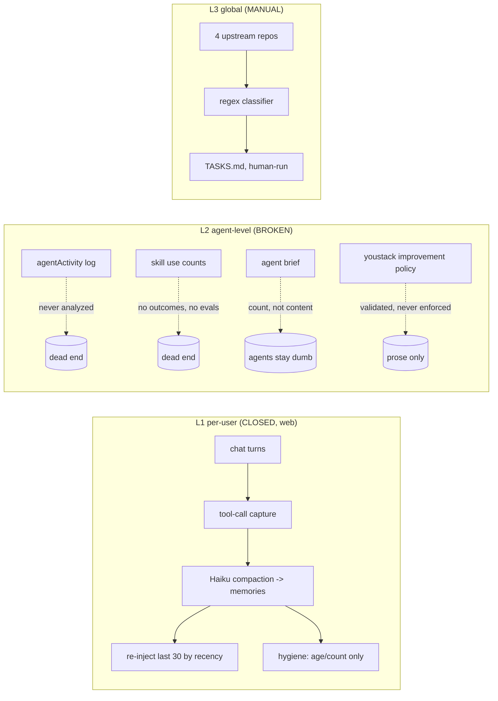
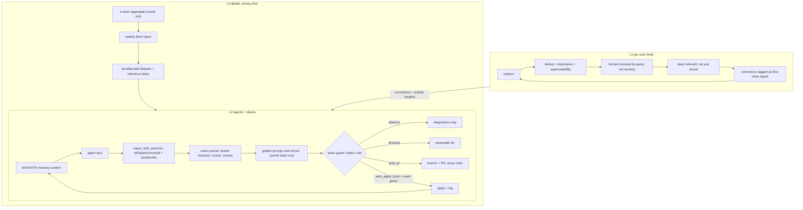
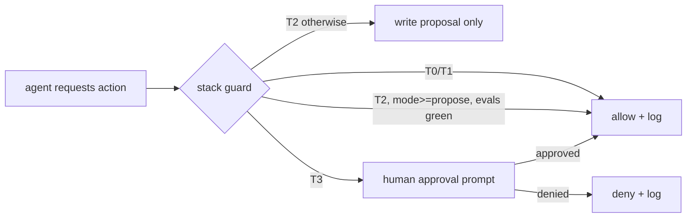

# Self-Improving System Design — You.md — 2026-06-11

You.md has the **skeleton of a three-level self-improving system: one loop actually closed, two loops that are well-specified scaffolding.** This document maps current state against the ideal architecture, with verified evidence, Mermaid diagrams, prioritized enhancements, and an explicit machine-checkable safety contract.

---

## 1. The Three Loops — Current State

| Level | Loop | Status | Evidence |
|---|---|---|---|
| L1 | Per-user: brain learns from conversations | **CLOSED (web only)** | Tool-call capture (`useYouAgent.ts:2349-2377`) → Haiku compaction (`convex/chat.ts:336-483`) → last-30 re-injection (`useYouAgent.ts:186-296`) → auto-hygiene at session start (`memories.ts:331-375`) |
| L2 | Agent-level: agents get smarter about you; skills/stacks improve from usage | **BROKEN at the last meter** | Brief excludes memories by default (`mcp/server.ts:1734`); markdown brief renders memory COUNT, never content (`server.ts:974-984`); meta-improve's documented metrics (successRate, avgDuration) do not exist in `SkillMetrics` (`cli/src/lib/skills.ts:922-931` tracks only uses/installs/lastUsed/lastInstalled); agentActivity is captured richly (`activity.ts:6-29`) but never analyzed |
| L3 | Global: product learns from upstream + fleet | **MANUAL + REPO-ONLY** | reference-intelligence is regex-classified, hand-run (`package.json:27`), watches 4 upstream repos, not users; only cross-user signal is a downloads counter (`convex/skills.ts:634-643`) |

### What deserves protection (already right)

- The L1 web loop is real, not aspirational — including automatic forgetting (archive >90d, cap 200, purge >180d), which most products never build.
- `youstack/v1` already encodes the correct self-improvement vocabulary: `improvement.mode (observe|propose|auto_pr|auto_apply_local)`, `signals`, `evals`, `approvalRequiredFor`, `update.autoApply` (`cli/src/lib/youstack.ts:38-53`), plus built-in `stack.diagnose/improve/update/maintain` capabilities (`:143-182`).
- Every self-modifying skill ships consent language (meta-improve.md:36, proactive-context-fill.md:26,31-35, youstack-maintainer.md:17-21,96-103).
- The substrate is hardened: requireOwner on every memory/activity/skill mutation (`memories.ts:18,107,335`, `activity.ts:61,97,173`).

---

## 2. Current vs Ideal Architecture

### 2.1 Current

### 2.2 Ideal

---

## 3. Prioritized Enhancements

### Tier 1 — close L2's last meter (S effort, immediate agent-IQ gain)

| # | Enhancement | Evidence |
|---|---|---|
| 1 | Render memory content (category + content, one line each, capped to maxChars) in `formatAgentBriefMarkdown`; markdown is the default consumption path | `mcp/server.ts:974-984` |
| 2 | Flip `includeMemories` default to true (8-item cap already bounds size) | `mcp/server.ts:1734` |
| 3 | Unify the memory category enum (schema comment says fact/insight/decision/preference/context/goal/relationship; extractor prompt allows fact/preference/decision/project/goal — they already disagree) and add `correction`. Teach prompts + compactSession to emit it when the user contradicts the agent. "User corrections" is the #1 declared improvement signal (`youstack-maintainer.md:62-69`) and nothing can capture it today | `convex/schema.ts:473`, `convex/chat.ts:405`, `mcp/server.ts:1543` |

### Tier 2 — make retrieval and memory hygiene intelligent (M)

| # | Enhancement | Evidence |
|---|---|---|
| 4 | Convex `searchIndex` on memories.content (built-in full-text); add `query` arg to `search_memories` (currently category+limit only — a search tool with no query string) and to GET /api/v1/me/memories. Embeddings are the end state; full-text-first is the right Layer-1 move | `mcp/server.ts:1536-1551`, `convex/schema.ts:482-486`, `memories.ts:42-45` |
| 5 | Add `importance`/`pinned` + `supersededBy` to memories schema; dedup pass in saveMemories (same category + normalized content prefix bumps updatedAt instead of inserting); exempt pinned from archiveStale. Today forgetting is purely chronological: a day-1 foundational preference dies at ~day 270 while yesterday's trivia survives | `memories.ts:116-129, 231-323` |

### Tier 3 — give the eval leg real data (M)

| # | Enhancement | Evidence |
|---|---|---|
| 6 | Extend `trackSkillEvent` with `{outcome: ok|failed|corrected, durationMs}`; add MCP `report_skill_outcome` tool, instructed via the rendered skill's footer (same pattern as brief reminders). Trim meta-improve.md to never claim untracked metrics | `cli/src/lib/skills.ts:922-980`, `cli/skills/meta-improve.md:38-51` |
| 7 | `activityInsights` query mining agentActivity for: unread identity sections per agent, repeated-read hot paths (cacheable brief), error-status actions, never-touched resources (prune candidates). Surface in `youmd skill improve` + dashboard. Zero new data collection — the table is already populated and auth-gated | `convex/activity.ts:6-29,90-163` |
| 8 | Fix improveCmd's sync heuristic: it reuses total skill uses as "syncCount" (identical expression to totalUses); track `lastSyncedAt` in skill-metrics.json and compare against the bundle's last identity-change timestamp | `skill.ts:916-920` vs `:809` |

### Tier 4 — enforce the declared stack contract (M-L; the line between autonomy and unsafety)

| # | Enhancement | Evidence |
|---|---|---|
| 9 | **Stack guard:** `youmd stack guard <action>` (also enforced inside route_stack_request/MCP) resolving requested capability against `improvement.mode` + `approvalRequiredFor` → allow / require-approval / deny. Today the entire policy is schema-validated prose: doctor only *recommends*, nothing checks mode before an agent mutates stack files | `youstack.ts:38-53, 460-492, 711-722`, `stack.ts:102` |
| 10 | **Golden-prompt eval runner:** `youmd stack eval` executes prompts/*.md against route_stack_request + rendered skills, diffs expected capability/route/output assertions, writes tests/eval-results.json with timestamps. Deterministic routing assertions are a lake (routeYouStackRequest is already deterministic, `youstack.ts:794`); LLM-judged evals are the ocean — defer | no eval runner exists anywhere in cli/src or convex/ |
| 11 | **Local improvement runner:** `youmd stack improve` journals every routed request + outcome to `stacks/<slug>/journal/`, gathers signals named in `improvement.signals`, runs `improvement.evals`, emits a proposal diff (propose) or PR (auto_pr). Make the journal format part of youstack/v1 so a stack can later graduate into an addressable sub-agent. Smallest visible win first: a "this stack wants to improve" card in StacksPane + a usage-driven NEXT line in doctor | `stack.ts:25-39` has no improve subcommand; signals are captured (`mcp/server.ts:493-517`, `convex/http.ts:2259`) but never read back |

**Architecture choice for #11** (three evaluated): (A) local-first runner — chosen: the manifest already encodes its contract, zero new trust surface, journal is portable. (B) server-orchestrated evolution via Convex crons — layered last, gated by brainScopes, because it moves private signals server-side before the trust story exists. (C) stack-as-sub-agent (per-stack MCP namespace + maintainer agent) — the end state; A's journal format makes C an incremental promotion, not a rewrite.

---

## 4. Safety Contract (explicit, machine-checkable)

Today every safety rule lives in prose duplicated across three skills with wording drift, invisible to doctor/smoke/guard — a jailbroken host agent faces no mechanical barrier. Consolidate into one SAFETY-CONTRACT spec, referenced (not restated) by meta-improve, proactive-context-fill, and youstack-maintainer, and enforced by the stack guard (#9).

| Tier | Actions | Policy | Enforcement |
|---|---|---|---|
| T0 | Read identity, brief, public profile | Always allowed | none needed (already auth-scoped) |
| T1 | Additive memory/context writes | Allowed, always logged to agentActivity | guard logs; never silent |
| T2 | Modify skills, stacks, identity sections | Propose-only unless manifest mode grants more AND `youmd stack eval` is green in the same run | guard checks mode + eval-results.json timestamp |
| T3 | Visibility widening, publishing, remote push, deletions, anything irreversible | Explicit per-action human approval; never autonomous regardless of mode | guard denies; requires interactive confirm |

Mode semantics (enforced, not advisory):

- `observe` → read-only diagnostics only; smoke/doctor FAIL (not warn) if a write_local capability exists under observe
- `propose` → writes only to `proposals/` directory
- `auto_pr` → branch + PR, never main
- `auto_apply_local` → requires `improvement.evals` non-empty AND a green `youmd stack smoke` + `stack eval` recorded in the same run

The principle: **autonomy for additive + local + evaluated; humans for destructive + public + irreversible.** A self-improving identity system lives or dies on whether its claimed writes are real — which is also why the CLI's fake "[saved private project]" success message (`chat.ts:2643-2645`) is a safety bug, not just a UX bug.
